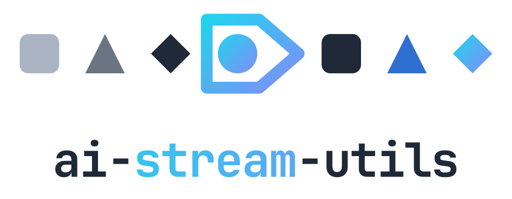

<div align='center'>

<picture>
  <source media="(prefers-color-scheme: dark)" srcset="assets/logo-dark.png" />
  
</picture>

<p align="center">AI SDK: Filter and transform UI messages while streaming to the client</p>
<p align="center">
  <a href="https://www.npmjs.com/package/ai-stream-utils" alt="ai-stream-utils"></a> <a href="https://github.com/zirkelc/ai-stream-utils/actions/workflows/ci.yml" alt="CI"></a>
</p>

</div>

This library provides composable filter and transformation utilities for UI message streams created by [`streamText()`](https://ai-sdk.dev/docs/reference/ai-sdk-core/stream-text) in the AI SDK.

### Why?

The AI SDK UI message stream created by [`toUIMessageStream()`](https://ai-sdk.dev/docs/reference/ai-sdk-core/stream-text#to-ui-message-stream) streams all parts (text, tools, reasoning, etc.) to the client by default. However, you may want to:

- **Filter**: Tool calls like database searches often contain large amounts of data or sensitive information that should not be streamed to the client
- **Transform**: Modify text or tool outputs while they are streamed to the client
- **Observe**: Log stream lifecycle events, update states, or run side-effects without modifying the stream

This library provides type-safe, composable utilities for all these use cases.

### Installation

> [!NOTE]
> Version compatibility:
>
> - Use [`ai-stream-utils@2.x`](https://github.com/zirkelc/ai-stream-utils/tree/v2.x) for AI SDK v6
> - Use [`ai-stream-utils@3.x`](https://github.com/zirkelc/ai-stream-utils/tree/v3.x) for AI SDK v7

```bash
npm install ai-stream-utils@2 # AI SDK v6
npm install ai-stream-utils@3 # AI SDK v7
```

## Usage

The `pipe` function provides a composable pipeline API for filtering, transforming, and observing UI message streams. Multiple operators can be chained together, and type guards automatically narrow chunk and part types, thus enabling type-safe stream transformations with autocomplete.

### `.filter()`

Filter chunks by returning `true` to keep or `false` to exclude.

```typescript
const stream = pipe(result.toUIMessageStream())
  .filter(({ chunk, part }) => {
    // chunk.type: "text-delta" | "text-start" | "tool-input-available" | ...
    // part.type: "text" | "reasoning" | "tool-weather" | ...

    if (chunk.type === "data-weather") {
      return false; // exclude chunk
    }

    return true; // keep chunk
  })
  .toStream();
```

#### Type Guards

Generic type guards provide a simpler API for common filtering patterns:

- `includeChunks("text-delta")` or `includeChunks(["text-delta", "text-end"])`: Include **only** specific chunk types
- `excludeChunks("text-delta")` or `excludeChunks(["text-delta", "text-end"])`: Exclude **only** specific chunk types
- `includeParts("text")` or `includeParts(["text", "reasoning"])`: Include **only** specific part types
- `excludeParts("reasoning")` or `excludeParts(["reasoning", "tool-database"])`: Exclude **only** specific part types

Filtering tools is the most common use case and the tool-filter type guards provide a convenient API for filtering tool chunks by tool name:

- `excludeTools()` or `excludeTools("weather")` or `excludeTools(["weather", "database"])`: Exclude all tools or specific tools by name
- `includeTools()` or `includeTools("weather")` or `includeTools(["weather", "database"])`: Include all tools or specific tools by name

> [!NOTE]
> The tool-filter type guards only affect tool chunks. Non-tool chunks will pass through.

#### Examples

Exclude tool calls from the client.

```typescript
// Exclude by part type (requires "tool-" prefix)
const stream = pipe(result.toUIMessageStream())
  .filter(excludeParts(["tool-weather", "tool-database"]))
  .toStream();

// Exclude by tool name (without "tool-" prefix)
const stream = pipe(result.toUIMessageStream())
  .filter(excludeTools(["weather", "database"]))
  .toStream();

// Exclude all tools
const stream = pipe(result.toUIMessageStream()).filter(excludeTools()).toStream();

// Include only specific tools (without "tool-" prefix)
const stream = pipe(result.toUIMessageStream())
  .filter(includeTools(["weather"]))
  .toStream();
```

> [!NOTE]
> `excludeTools()` and `includeTools()` filters tool chunks on the server before streaming to the client. This affects all tool types including:
>
> - Server-side tools with `execute` functions
> - Client-side tools without `execute` functions
> - Tools that require human approval via `needsApproval`
>
> Excluded tools will not appear in the client's message parts, so users won't see tool call UI or be able to approve/reject filtered tools.

### `.map()`

Transform chunks by returning a chunk, an array of chunks, or `null` to exclude.

```typescript
const stream = pipe(result.toUIMessageStream())
  .map(({ chunk, part }) => {
    // chunk.type: "text-delta" | "text-start" | "tool-input-available" | ...
    // part.type: "text" | "reasoning" | "tool-weather" | ...

    if (chunk.type === "text-start") {
      return chunk; // pass through unchanged
    }

    if (chunk.type === "text-delta") {
      return { ...chunk, delta: "modified" }; // transform chunk
    }

    if (chunk.type === "data-weather") {
      return [chunk1, chunk2]; // emit multiple chunks
    }

    return null; // exclude chunk (same as filter)
  })
  .toStream();
```

#### Examples

Convert text to uppercase.

```typescript
const stream = pipe(result.toUIMessageStream())
  .map(({ chunk }) => {
    if (chunk.type === "text-delta") {
      return { ...chunk, delta: chunk.delta.toUpperCase() };
    }

    return chunk;
  })
  .toStream();
```

#### Helpers

`transformProviderMetadata()` changes `providerMetadata` on the chunks that carry it (`text-*`, `reasoning-*`, `reasoning-file`, `tool-input-*`, `tool-output-available`, `tool-output-error`, `tool-approval-response`, `source-*`, `file`, `custom`). Every other chunk passes through untouched, so you don't have to narrow by chunk type yourself.

The callback receives the current `metadata` (may be `undefined`) and returns one of three things:

- an **object** to set/replace the metadata (merge by spreading `metadata`)
- **`undefined`** to leave the chunk unchanged
- **`null`** to remove the `providerMetadata` field entirely (the chunk still passes through)

```typescript
const stream = pipe(result.toUIMessageStream())
  .map(
    transformProviderMetadata(({ chunk, part, metadata }) => {
      if (chunk.type === "tool-input-available")
        return { ...metadata, app: { toolCallId: chunk.toolCallId } }; // add to tool input chunks

      if (part.type === "text") return null; // delete for text parts

      return undefined; // leave everything else unchanged
    }),
  )
  .toStream();
```

### `.on()`

Observe chunks without modifying the stream. The callback is invoked for matching chunks.

```typescript
const stream = pipe(result.toUIMessageStream())
  .on(
    (predicate) => {
      const { chunk, part } = predicate;
      // return true to invoke callback, false to skip
      return chunk.type === "text-delta";
    },
    (callback) => {
      const { chunk, part } = callback;
      // callback invoked for matching chunks
      console.log(chunk, part);
    },
  )
  .toStream();
```

#### Type Guards

**Type guard** provides a type-safe way to observe specific chunk types:

- `chunkType("text-delta")` or `chunkType(["start", "finish"])`: Observe specific chunk types
- `partType("text")` or `partType(["text", "reasoning"])`: Observe chunks belonging to specific part types
- `toolCall()` or `toolCall({ tool: "weather" })` or `toolCall({ state: "output-available" })`: Observe tool state transitions

> [!NOTE]
> The `partType` type guard still operates on chunks. That means `partType("text")` will match any text chunks such as `text-start`, `text-delta`, and `text-end`.

The `toolCall()` type guard matches tool chunks representing state transitions (not streaming events):

- `input-available`: Tool input fully parsed
- `approval-requested`: Tool awaiting user approval
- `output-available`: Tool execution completed
- `output-error`: Tool execution failed
- `output-denied`: User denied approval

#### Examples

Log stream lifecycle events.

```typescript
const stream = pipe(result.toUIMessageStream())
  .on(chunkType("start"), ({ chunk }) => {
    console.log("Stream started:", chunk.messageId);
  })
  .on(chunkType("finish"), ({ chunk }) => {
    console.log("Stream finished:", chunk.finishReason);
  })
  .on(chunkType("tool-input-available"), ({ chunk }) => {
    console.log("Tool input:", chunk.input);
  })
  .on(chunkType("tool-output-available"), ({ chunk }) => {
    console.log("Tool output:", chunk.output);
  })
  .toStream();
```

Observe tool state transitions for a specific tool.

```typescript
const stream = pipe(result.toUIMessageStream())
  .on(toolCall({ tool: "weather", state: "approval-requested" }), ({ chunk }) => {
    console.log("Weather tool needs approval");
  })
  .on(toolCall({ tool: "weather", state: "output-available" }), ({ chunk }) => {
    console.log("Weather output:", chunk.output);
  })
  .on(toolCall({ tool: "weather", state: "input-available" }), ({ chunk }) => {
    console.log("Weather input:", chunk.input);
  })
  .toStream();
```

Observe all tool calls.

```typescript
const stream = pipe(result.toUIMessageStream())
  // on
  .on(toolCall({ state: `input-available` }), ({ chunk, part }) => {
    console.log(`Tool call ${part.type} (${chunk.toolCallId}) input=`, chunk.input);
  })
  /** onResult */
  .on(toolCall({ state: `output-available` }), ({ chunk, part }) => {
    console.log(`Tool result ${part.type} (${chunk.toolCallId}) output=`, chunk.output);
  })
  /** onError */
  .on(toolCall({ state: `output-error` }), ({ chunk, part }) => {
    console.log(`Tool error ${part.type} (${chunk.toolCallId}) error=`, chunk.errorText);
  })
  .toStream();
```

### `.toStream()`

Convert the pipeline back to a `AsyncIterableStream<InferUIMessageChunk<UI_MESSAGE>>` that can be returned to the client or consumed.

```typescript
const stream = pipe(result.toUIMessageStream())
  .filter(({ chunk }) => {})
  .map(({ chunk }) => {})
  .toStream();

// Iterate with for-await-of
for await (const chunk of stream) {
  console.log(chunk);
}

// Consume as ReadableStream
for await (const message of readUIMessageStream({ stream })) {
  console.log(message);
}

// Return to client with useChat()
return stream;
```

### Chaining and Type Narrowing

Multiple operators can be chained together. After filtering with type guards, chunk and part types are narrowed automatically.

```typescript
const stream = pipe<MyUIMessage>(result.toUIMessageStream())
  .filter(includeParts("text"))
  .map(({ chunk, part }) => {
    // chunk is narrowed to text chunks: "text-start" | "text-delta" | "text-end"
    // part is narrowed to "text"
    return chunk;
  })
  .toStream();
```

### Control Chunks

[Control chunks](https://github.com/vercel/ai/blob/main/packages/ai/src/ui-message-stream/ui-message-chunks.ts#L278-L293) always pass through regardless of filter/transform settings:

- `start`: Stream start marker
- `finish`: Stream finish marker
- `abort`: Stream abort marker
- `message-metadata`: Message metadata updates
- `error`: Error messages

## Stream Utilities

Helper functions for consuming streams and converting between streams, arrays, and async iterables.

### `consumeUIMessageStream`

Consumes a UI message stream by fully reading it and returns the final assembled message. Useful for server-side processing without streaming to the client.

```typescript
import { consumeUIMessageStream } from "ai-stream-utils";

const result = streamText({
  model: openai("gpt-4o"),
  prompt: "Tell me a joke",
});

const message = await consumeUIMessageStream(result.toUIMessageStream<MyUIMessage>());

console.log(message.parts); // All parts fully assembled
```

### `createAsyncIterableStream`

Adds async iterator protocol to a `ReadableStream`, enabling `for await...of` loops.

```typescript
import { createAsyncIterableStream } from "ai-stream-utils";

const asyncStream = createAsyncIterableStream(readableStream);
for await (const chunk of asyncStream) {
  console.log(chunk);
}
```

### `convertArrayToStream`

Converts an array to a `ReadableStream` that emits each element.

```typescript
import { convertArrayToStream } from "ai-stream-utils";

const stream = convertArrayToStream([1, 2, 3]);
```

### `convertAsyncIterableToStream`

Converts an async iterable (e.g., async generator) to a `ReadableStream`.

```typescript
import { convertAsyncIterableToStream } from "ai-stream-utils";

async function* generator() {
  yield 1;
  yield 2;
}
const stream = convertAsyncIterableToStream(generator());
```

### `convertAsyncIterableToArray`

Collects all values from an async iterable into an array.

```typescript
import { convertAsyncIterableToArray } from "ai-stream-utils";

const array = await convertAsyncIterableToArray(asyncIterable);
```

### `convertStreamToArray`

Consumes a `ReadableStream` and collects all chunks into an array.

```typescript
import { convertStreamToArray } from "ai-stream-utils";

const array = await convertStreamToArray(readableStream);
```

### `convertUIMessageToSSEStream`

Converts a UI message stream to an SSE (Server-Sent Events) stream. Useful for sending UI message chunks over HTTP as SSE-formatted text.

```typescript
import { convertUIMessageToSSEStream } from "ai-stream-utils";

const uiStream = result.toUIMessageStream();
const sseStream = convertUIMessageToSSEStream(uiStream);

// Output format: "data: {...}\n\n" for each chunk
```

### `convertSSEToUIMessageStream`

Converts an SSE stream back to a UI message stream. Useful for parsing SSE-formatted responses on the client.

```typescript
import { convertSSEToUIMessageStream } from "ai-stream-utils";

const response = await fetch("/api/chat");
const sseStream = response.body.pipeThrough(new TextDecoderStream());
const uiStream = convertSSEToUIMessageStream(sseStream);
```

## Type Safety

The [`toUIMessageStream()`](https://ai-sdk.dev/docs/reference/ai-sdk-core/stream-text#to-ui-message-stream) from [`streamText()`](https://ai-sdk.dev/docs/reference/ai-sdk-core/stream-text) returns a generic `ReadableStream<UIMessageChunk>`, which means the part types cannot be inferred automatically.

To enable autocomplete and type-safety, pass your [`UIMessage`](https://ai-sdk.dev/docs/reference/ai-sdk-core/ui-message#creating-your-own-uimessage-type) type as a generic parameter:

```typescript
import type { UIMessage, InferUITools } from "ai";

type MyUIMessageMetadata = {};
type MyDataPart = {};
type MyTools = InferUITools<typeof tools>;

type MyUIMessage = UIMessage<MyUIMessageMetadata, MyDataPart, MyTools>;

// Use MyUIMessage type when creating the UI message stream
const uiStream = result.toUIMessageStream<MyUIMessage>();

// Type-safe filtering with autocomplete
const stream = pipe<MyUIMessage>(uiStream)
  .filter(includeParts(["text", "tool-weather"])) // Autocomplete works!
  .map(({ chunk, part }) => {
    // part.type is typed based on MyUIMessage
    return chunk;
  })
  .toStream();
```

## Client-Side Usage

The transformed stream has the same type as the original UI message stream. You can consume it with [`useChat()`](https://ai-sdk.dev/docs/reference/ai-sdk-ui/use-chat) or [`readUIMessageStream()`](https://ai-sdk.dev/docs/reference/ai-sdk-ui/read-ui-message-stream).

Since message parts may be different on the client vs. the server, you may need to reconcile message parts when the client sends messages back to the server.

If you save messages to a database and configure `useChat()` to [only send the last message](https://ai-sdk.dev/docs/ai-sdk-ui/chatbot-message-persistence#sending-only-the-last-message), you can read existing messages from the database. This means the model will have access to all message parts, including filtered parts not available on the client.

## API

## `pipe(input)`

- `input`, a `ReadableStream<UIMessageChunk>` or an `AsyncIterable<UIMessageChunk>`

Returns a `ChunkPipeline` with chainable operators. Pass your `UIMessage` type as `pipe<MyUIMessage>(input)` to type the chunk and part unions. The pipeline is itself an `AsyncIterable`, and it can only be consumed once.

```ts
const stream = pipe<MyUIMessage>(result.toUIMessageStream<MyUIMessage>())
  .filter(excludeTools())
  .toStream();
```

#### `.filter(guard)` / `.filter(predicate)`

Drop chunks from the stream. Pass a type guard to narrow the chunk and part types for every later operator, or a plain predicate receiving `{ chunk, part }` and returning `true` to keep. Meta chunks always pass through, so the callback only sees content chunks.

```ts
pipe<MyUIMessage>(stream).filter(includeParts(["text"]));

pipe<MyUIMessage>(stream).filter(({ chunk, part }) => part.type !== "reasoning");
```

#### `.map(fn)`

Transform chunks. The callback receives `{ chunk, part }` and returns a chunk, an array of chunks, or `null` to drop it.

```ts
pipe<MyUIMessage>(stream).map(({ chunk }) => {
  if (chunk.type === "text-delta") return { ...chunk, delta: chunk.delta.toUpperCase() };
  return chunk;
});
```

#### `.on(guard, callback)` / `.on(predicate, callback)`

Observe chunks without changing the stream. Every chunk passes through regardless of whether the callback runs. The callback may be async and is awaited; a throw propagates and fails the stream. For meta chunks `part` is `undefined`.

```ts
pipe<MyUIMessage>(stream).on(toolCall({ state: "output-available" }), async ({ chunk, part }) => {
  await log(part.type, chunk.output);
});
```

#### `.toStream()`

Execute the pipeline and return an `AsyncIterableStream<UIMessageChunk>`. Throws if the pipeline was already consumed.

```ts
const stream = pipe<MyUIMessage>(input).filter(excludeTools()).toStream();
```

## `includeChunks(types)` / `excludeChunks(types)`

Filter guards matching chunks by chunk type. Accept a single type or an array. Meta chunks pass through either way.

```ts
pipe<MyUIMessage>(stream).filter(includeChunks("text-delta"));
pipe<MyUIMessage>(stream).filter(excludeChunks(["text-start", "text-end"]));
```

## `includeParts(types)` / `excludeParts(types)`

Filter guards matching chunks by the part they belong to. Accept a single type or an array. A part type covers every chunk that builds it, so `includeParts('text')` keeps `text-start`, `text-delta` and `text-end`.

```ts
pipe<MyUIMessage>(stream).filter(includeParts(["text", "reasoning"]));
pipe<MyUIMessage>(stream).filter(excludeParts("tool-weather"));
```

## `includeTools(names?)` / `excludeTools(names?)`

Filter guards matching tool chunks by tool name, without the `tool-` prefix. Called with no argument they match every tool, including dynamic ones. Non-tool chunks always pass through.

```ts
pipe<MyUIMessage>(stream).filter(excludeTools());
pipe<MyUIMessage>(stream).filter(excludeTools(["weather", "database"]));
pipe<MyUIMessage>(stream).filter(includeTools("weather"));
```

## `chunkType(types)` / `partType(types)`

Observe guards for `.on()`, matching by chunk type or by part type. Accept a single type or an array. `chunkType` matches meta chunks, `partType` does not.

```ts
pipe<MyUIMessage>(stream).on(chunkType(["start", "finish"]), ({ chunk }) => track(chunk.type));
pipe<MyUIMessage>(stream).on(partType("text"), ({ chunk }) => buffer(chunk));
```

## `toolCall(options?)`

Observe guard for `.on()` matching tool state transitions. Streaming chunks such as `tool-input-start` and `tool-input-delta` are never matched.

- `options.tool` (optional), a tool name without the `tool-` prefix (default: every tool)
- `options.state` (optional), one of `'input-available'`, `'approval-requested'`, `'output-available'`, `'output-error'`, `'output-denied'` (default: every state)

```ts
pipe<MyUIMessage>(stream).on(toolCall(), ({ chunk, part }) => log(part.type, chunk.type));
pipe<MyUIMessage>(stream).on(toolCall({ tool: "weather" }), ({ part }) => log(part.type));
pipe<MyUIMessage>(stream).on(
  toolCall({ tool: "weather", state: "output-available" }),
  ({ chunk }) => log(chunk.output),
);
```

## `transformProviderMetadata(fn)`

A `.map()` callback that rewrites `providerMetadata` on the chunks that carry it and passes every other chunk through untouched. The callback receives `{ chunk, part, metadata }`, where `metadata` may be `undefined`, and returns an object to set it, `undefined` to leave the chunk alone, or `null` to remove the field. `null` removes the field, not the chunk.

```ts
pipe<MyUIMessage>(stream).map(
  transformProviderMetadata(({ chunk, part, metadata }) => {
    if (part.type === "text") return null;
    return { ...metadata, app: { traceId } };
  }),
);
```

## `consumeUIMessageStream(stream)`

- `stream`, a `ReadableStream<UIMessageChunk>`

Reads the stream to completion and resolves with the final assembled `UIMessage`. Throws if the stream ends without producing a message.

```ts
const message = await consumeUIMessageStream<MyUIMessage>(
  pipe<MyUIMessage>(stream)
    .filter(includeParts(["text"]))
    .toStream(),
);
```
